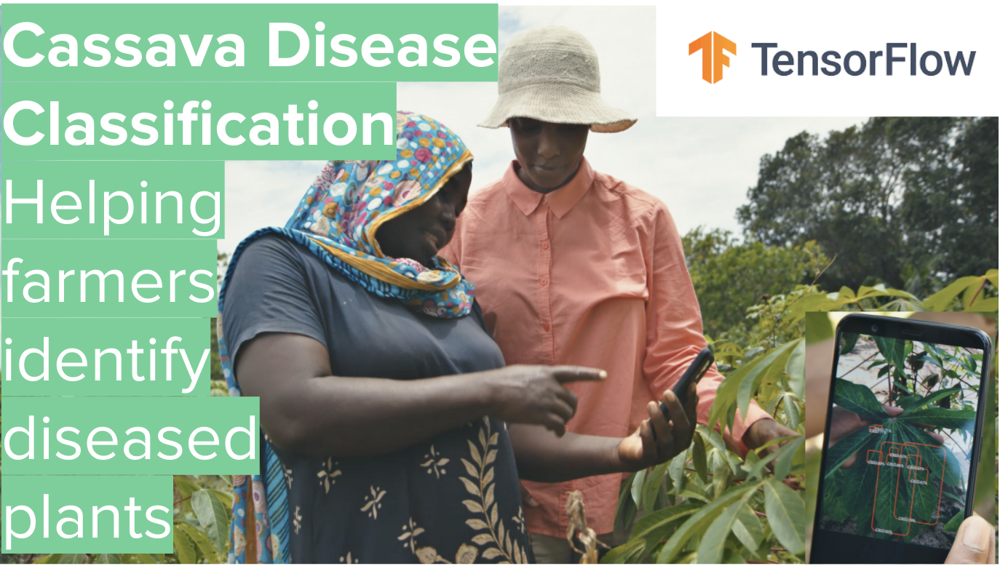
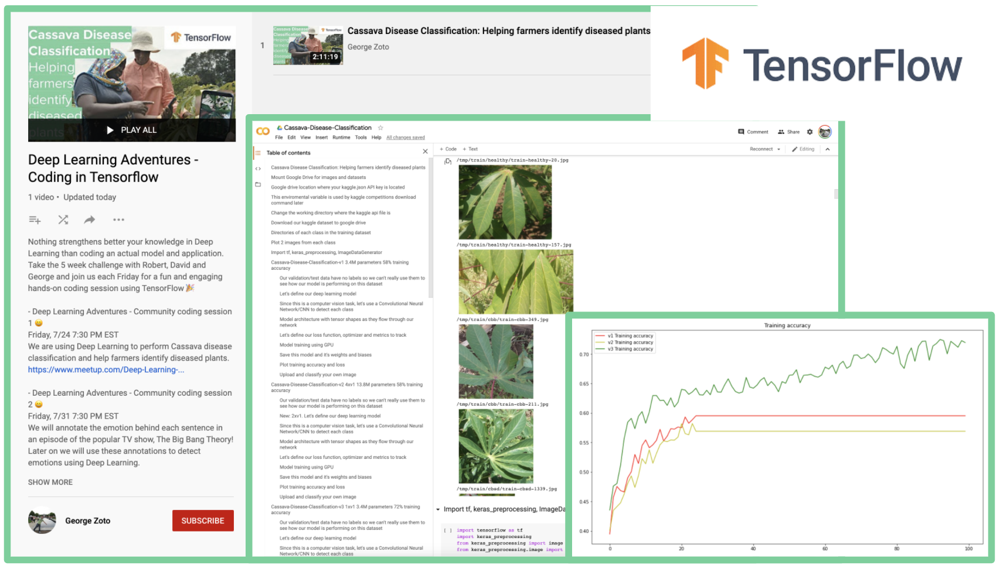

Join us for our 1st community coding adventure in Deep Learning! Just bring your curiosity and get ready to meet our growing community 😀 We are using Deep Learning to perform Cassava disease classification and help farmers identify diseased plants.

Agenda:  
- Introductions and get to know our community

- Deep Learning YouTube recordings, feel free to share and subscribe 😀  
https://bit.ly/deep-learning-tf
https://bit.ly/deep-learning-tf-coding

- Deep Learning Adventures - Coding Presentation:  
https://docs.google.com/presentation/d/1XXSLSTDOUnlYK1ksA4p3Kym-sDd7Nzj2r7__2fYqkxo/edit?usp=sharing

- Code repository for our Deep Learning Adventures 🎉  
https://github.com/georgezoto/Deep-Learning-Adventures

- Join us on Slack:  
https://join.slack.com/t/deeplearninga-nmk8930/shared_invite/zt-fupjj8pi-8Mb_D6dVRjTrrG9cktaehQ

- Spread the word about our meetup 🎉  

- Coding session on real world data - Computer Vision/CNNs  
Cassava Disease Classification: Helping farmers identify diseased plants  

- Step 1 😀  
Read more about the issue and the underlying problem here:  
https://www.blog.google/technology/ai/ai-takes-root-helping-farmers-identity-diseased-plants

- Step 2 😀  
Explore and download the dataset here:  
https://www.kaggle.com/c/cassava-disease/overview  
or here:  
https://www.tensorflow.org/datasets/catalog/cassava  

- Step 3 😀  
Build your computer vision classification model using deep learning or any other ML or non-AI approach. Feel free to use any environment you feel comfortable: personal computer, Colab, Kaggle, GCP/AWS virtual machine. Feel free to use any model you are comfortable with and spend some time in hyper-paramater tuning to make sure you are not overfitting your training data while optimizing for train/validation accuracy and loss. We recommend you use TensorFlow so it's easier to comment on each other's code but you don't have to.

- Step 4 😀  
Have fun 🎉 and share your journey, findings, lessons learned, success or failures with us and be ready to take a deeper dive in our code. For us, it's the effort that counts and not the final result. Most importantly you should enjoy exploring this interesting dataset and learn something new 😀  

As the 2nd largest provider of carbohydrates in Africa, cassava is a key food security crop grown by small-holder farmers because it can withstand harsh conditions. At least 80% of small-holder farmer households in Sub-Saharan Africa grow cassava and viral diseases are major sources of poor yields.  

In this hands-on coding session, we will use a dataset of 5 fine-grained cassava leaf disease categories with 9,436 labeled images collected during a regular survey in Uganda, mostly crowdsourced from farmers taking images of their gardens, and annotated by experts at the National Crops Resources Research Institute (NaCRRI) in collaboration with the AI lab in Makarere University, Kampala.  

The dataset consists of leaf images of the cassava plant, with 9,436 annotated images and 12,595 unlabeled images of cassava leaves. The goal is to learn a model to classify a given image into these 4 disease categories or a 5th category indicating a healthy leaf, using the images in the training data (participants can choose to use the unlabeled images in their training data). This past Kaggle competition is part of the fine-grained visual-categorization workshop (FGVC6 workshop) at CVPR 2019.  

Acknowledgements  
We thank the different experts and collaborators from NaCRRI for assisting in preparing this dataset

Citation  
Please cite this paper if you use the dataset for your project: https://arxiv.org/pdf/1908.02900.pdf

Source:  
https://www.blog.google/technology/ai/ai-takes-root-helping-farmers-identity-diseased-plants  
https://www.kaggle.com/c/cassava-disease/overview  
https://www.tensorflow.org/datasets/catalog/cassava  
