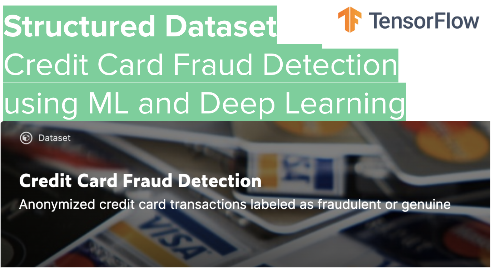
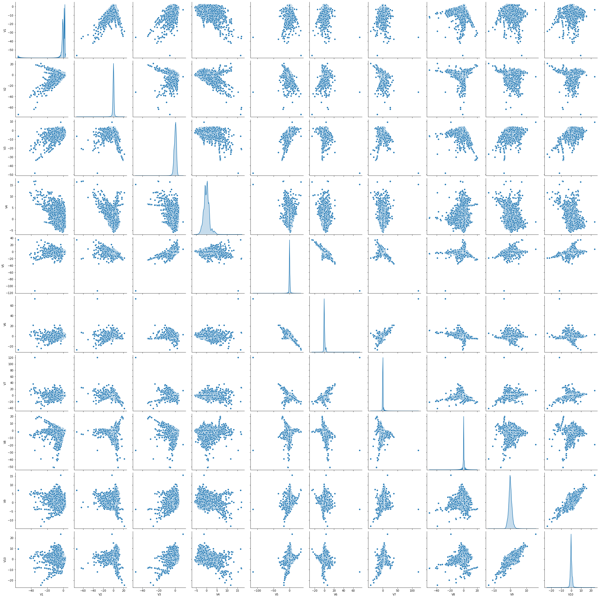
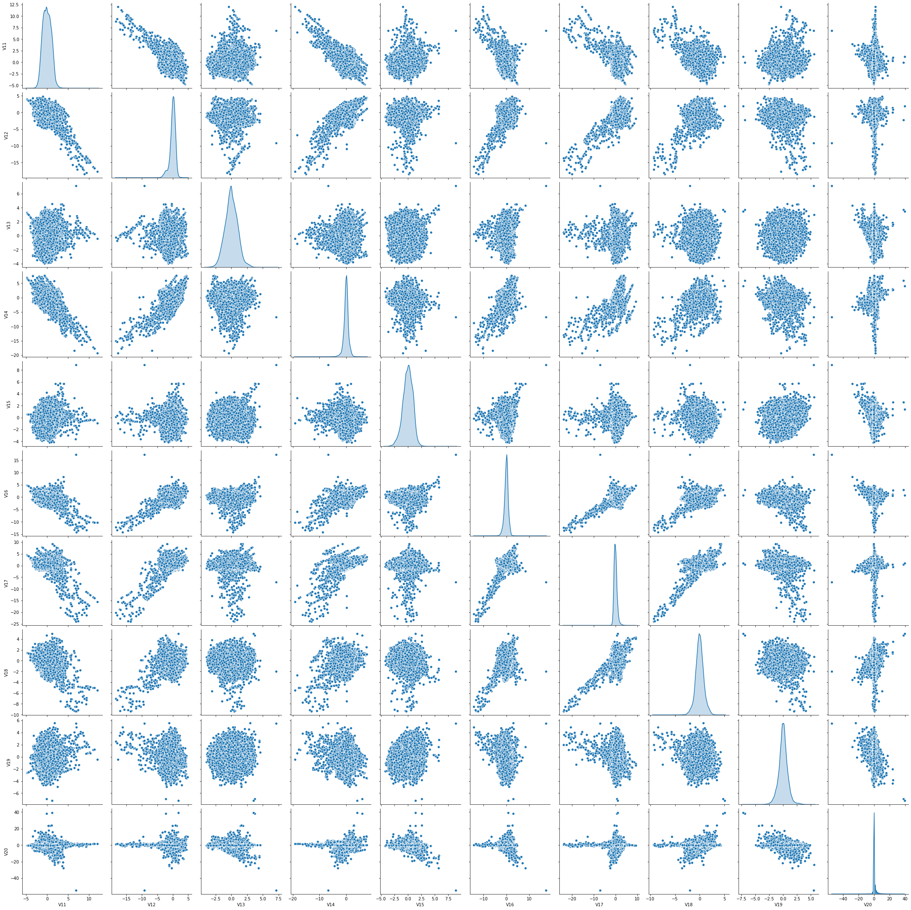
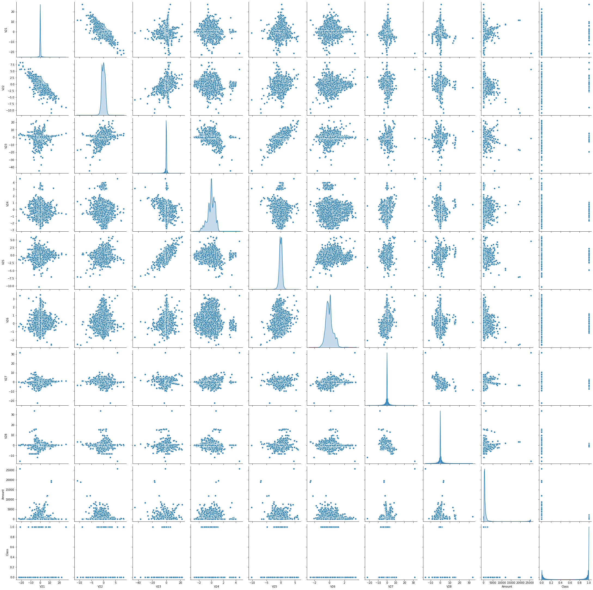

https://www.meetup.com/Deep-Learning-Adventures/events/272091530/

Join us for our 4th community coding adventure in Deep Learning! Just bring your curiosity and get ready to meet our growing community 😀 We are using Deep Learning to detect fraud in an ocean of transactions using ML and Deep Learning!

Agenda:
- Introductions and get to know our community

- Deep Learning YouTube recordings, feel free to share and subscribe 😀
https://bit.ly/deep-learning-tf
https://bit.ly/deep-learning-tf-coding

- Deep Learning Adventures - Coding Presentation:
https://docs.google.com/presentation/d/1XXSLSTDOUnlYK1ksA4p3Kym-sDd7Nzj2r7__2fYqkxo/edit?usp=sharing

- Join us on Slack:
https://join.slack.com/t/deeplearninga-nmk8930/shared_invite/zt-fupjj8pi-8Mb_D6dVRjTrrG9cktaehQ

- Spread the word about our meetup 🎉

- Coding session on real world data - Structured Data

- Step 1 😀
Learn more about the underlying problem and dataset and why it is important that credit card companies are able to recognize fraudulent credit card transactions so that customers are not charged for items that they did not purchase here: https://www.kaggle.com/mlg-ulb/creditcardfraud

- Step 2 😀
Be ready to tackle a highly imbalanced dataset. It contains transactions made by credit cards in September 2013 by European cardholders.
This dataset presents transactions that occurred in two days, where we have 492 frauds out of 284,807 transactions. The dataset is highly unbalanced, the positive class (frauds) account for 0.172% of all transactions.

- Step 3 😀
Become familiar with Deep Learning approaches for structured/tabular data. TensorFlow has great tutorials including:

Basic regression: Predict fuel efficiency: https://www.tensorflow.org/tutorials/keras/regression

Petfinder and classifying structured data with feature columns
https://www.tensorflow.org/tutorials/structured_data/feature_columns

Classification on imbalanced data on this same credit card dataset
https://www.tensorflow.org/tutorials/structured_data/imbalanced_data

- Step 4 😀
The goal is to identify fraudulent credit card transactions using ML or Deep Learning models. Given the class imbalance ratio, we recommend measuring the accuracy using the Area Under the Precision-Recall Curve (AUPRC). Confusion matrix accuracy is not meaningful for unbalanced classification. We recommend using the TensorFlow tf.keras.metrics.AUC(curve='PR') as our performance and scoring metric.

- Step 5 😀
To get ready for this week's coding challenge, check out this blog post by Rachel Draelos introducing our performance metric for the week: AUPRC (area under the precision-recall curve). She provides a nice description of the AUPRC metric, explains why it is especially useful for imbalanced classification problems, and discusses what you can expect when applying it to your dataset.
https://glassboxmedicine.com/2019/03/02/measuring-performance-auprc/

- Step 6 😀
Along with having a common metric ,AUPRC, for comparison, it is important to have the same test data to run the metric against. So let's all of us use the following approach:
df = pd.read_csv('creditcard.csv')
from sklearn.model_selection import train_test_split
train_df, test_df = train_test_split(df, stratify=df['Class'], test_size=0.2, random_state=51)

It is not necessary for comparison, but many people will further split the training data into training and validation via something like:
train_df, val_df = train_test_split(train_df, stratify=df['Class'], test_size=0.2, random_state=51)

- Step 7 😀
Have fun 🎉 and share your journey, findings, lessons learned, success or failures with us and be ready to take a deeper dive in our code. For us, it's the effort that counts and not the final result. Most importantly you should enjoy exploring this interesting dataset and learn something new 😀

Source:
https://www.kaggle.com/mlg-ulb/creditcardfraud
