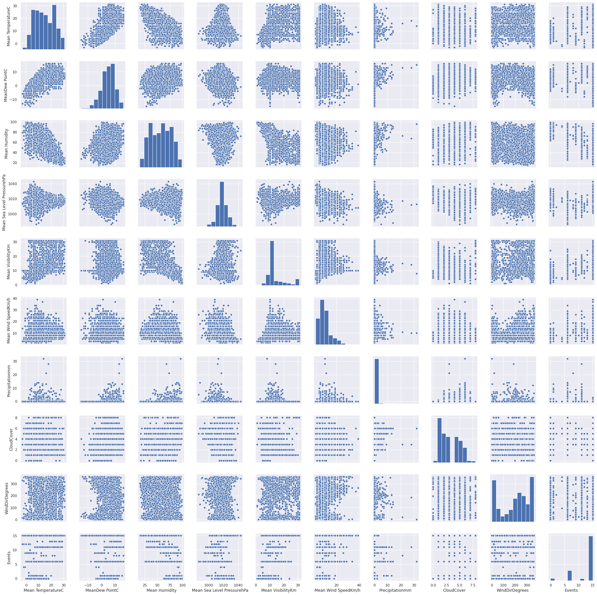

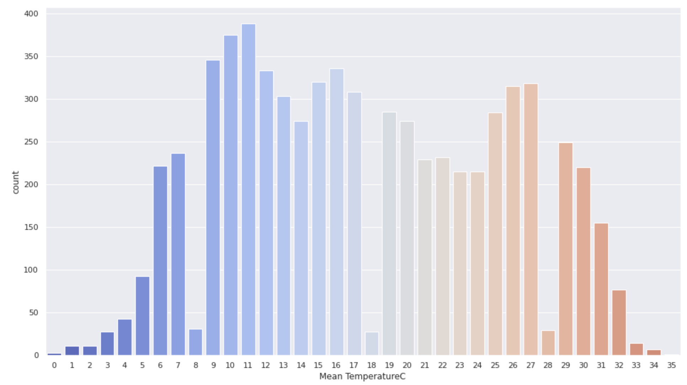

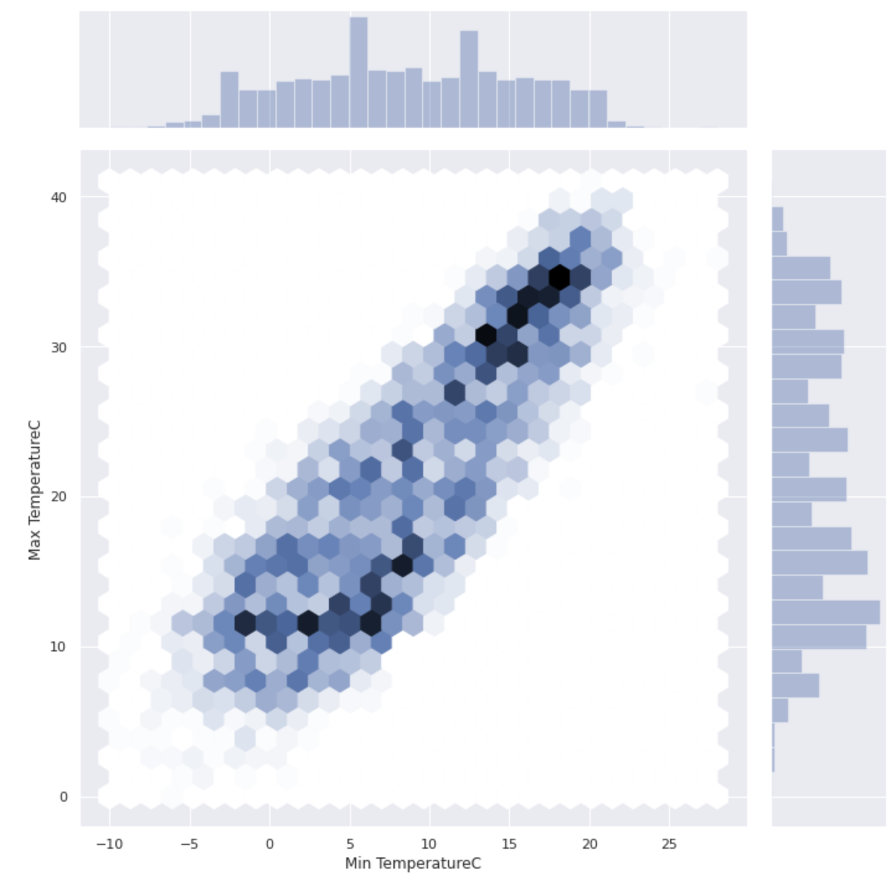

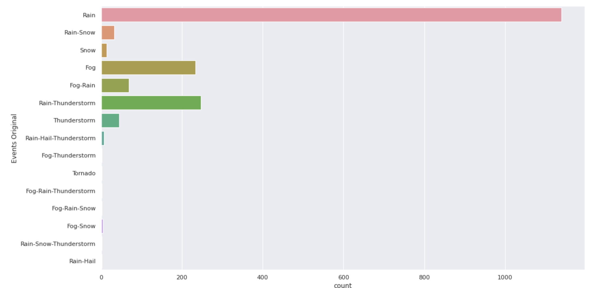

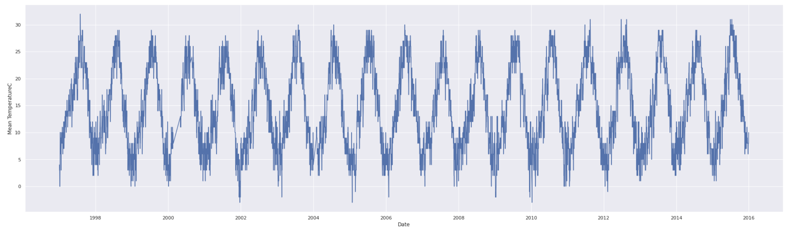

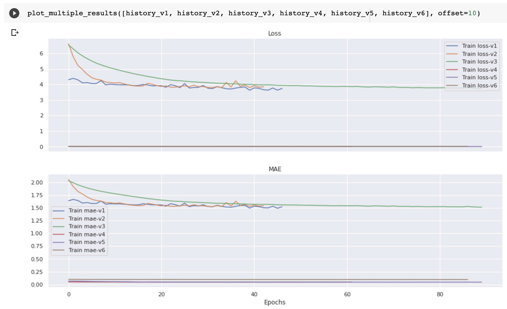

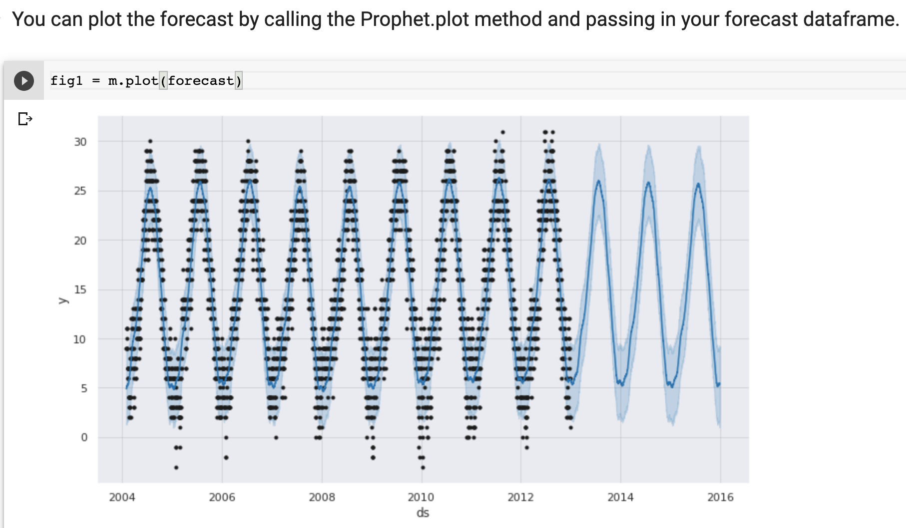

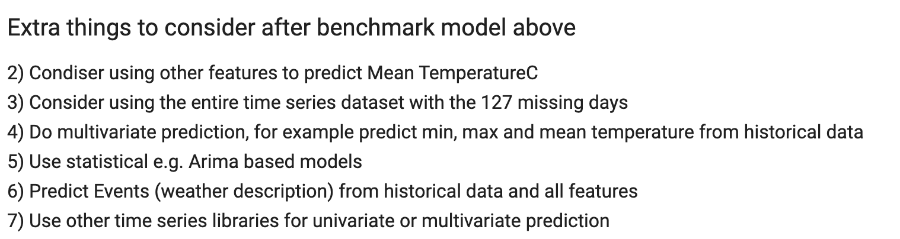

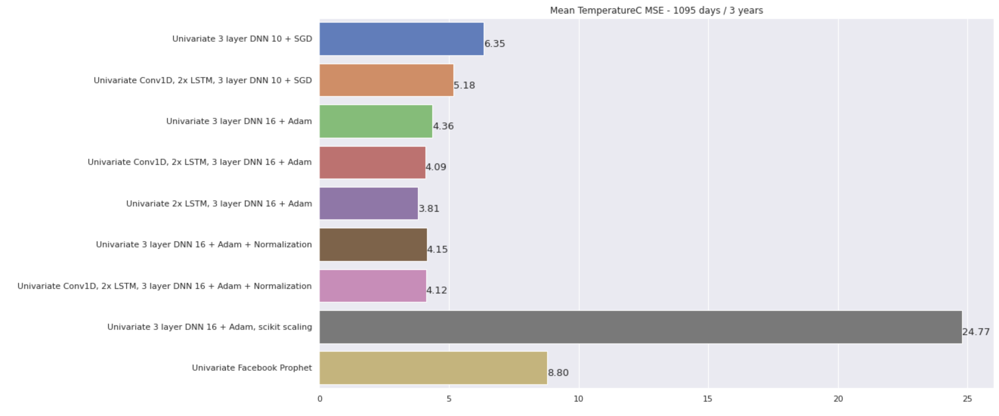

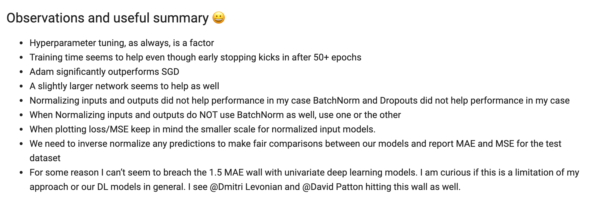

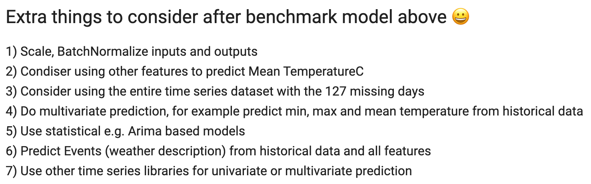

https://www.meetup.com/Deep-Learning-Adventures/events/272091576

Join us for our 5th community coding adventure in Deep Learning! Just bring your curiosity and get ready to meet our growing community 😀 We are using ML and Deep Learning to perform time series prediction of weather data in Madrid, Spain!

Join Zoom Meeting:
https://us02web.zoom.us/j/84402592502?pwd=d1lVSkxQZE1sSGljR3dXaEZwYmNEdz09

Phone: +1 929 205 6099 US
Meeting ID: 844 0259 2502

Agenda:
- Introductions and get to know our community

- Deep Learning YouTube recordings, feel free to share and subscribe 😀
https://bit.ly/deep-learning-tf
https://bit.ly/deep-learning-tf-coding

- Deep Learning Adventures - Coding Presentation:
https://docs.google.com/presentation/d/1XXSLSTDOUnlYK1ksA4p3Kym-sDd7Nzj2r7__2fYqkxo/edit?usp=sharing

- Code repository for our Deep Learning Adventures 🎉
https://github.com/georgezoto/Deep-Learning-Adventures

- Join us on Slack:
https://join.slack.com/t/deeplearninga-nmk8930/shared_invite/zt-gpqxpg6u-U7TRpIRE3NgsAum6BC2IZQ

- Spread the word about our meetup 🎉

- Coding session on real world data - Time Series
- Step 1 😀
Explore and learn more about this multivariate time series data from this Kaggle dataset:
https://www.kaggle.com/juliansimon/weather_madrid_lemd_1997_2015.csv

- Step 2 😀
Do some data exploration, look for missing dates or missing values as well as how each field is distributed or correlated with other fields

- Step 3 😀
Let's get coding! We will use historical daily data to predict weather/temperature 3 years from a given date!

#Download and read data from Kaggle
dataset = pd.read_csv(dataset_path, parse_dates=['CET'])

- Step 4 😀
#Keep only records from '2004-02-01' and forward due to missing days in previous records.
#See also "extra things" to consider in the end.

#As a benchmark, we will look only at 'Mean TemperatureC' (average temperature in Celsius) for univariate time series prediction

series = np.array(dataset['Mean TemperatureC'])
time = np.array(dataset.index)
plt.figure(figsize=(16, 9))
plot_series(time, series)

- Step 5 😀
#As a group, we will use the following Train, Validation (optional) and Test split.
#This means that we are keeping data:
from 2004-02-01 to 2010-12-31 for training, #7 years of daily data
from 2011-01-01 to 2012-12-31 for validation, #optional, can be combined with the training set. 2 years of daily data
from 2013-01-01 to 2015-12-31 for test, #3 years of daily data

split_time = dataset[dataset['Date'] == '2012-12-31'].index[0] + 1
time_train = time[:split_time]
x_train = series[:split_time]

time_test = time[split_time:]
x_test = series[split_time:]

validation_split_time = dataset[dataset['Date'] == '2010-12-31'].index[0] + 1
time_valid = time_train[validation_split_time:]
x_valid = x_train[validation_split_time:]

- Step 6 😀
#We will MAE/mean_absolute_error and MSE/mean_squared_error as comparison metrics on the test set.
#You can use either metric as your loss function during training and validation
tf.keras.metrics.mean_absolute_error(x_test, results).numpy()
tf.keras.metrics.mean_squared_error(x_test, results).numpy()

- Step 7 😀
Build your time series prediction model using statistics, data science, machine learning or deep learning or any other ML or non-AI approach. Feel free to use any environment you feel comfortable: personal computer, Colab, Kaggle, GCP/AWS virtual machine. Feel free to use any model you are comfortable with and spend some time in hyper-paramater tuning to make sure you are not overfitting your training data while optimizing for train/validation accuracy and loss. We recommend you use TensorFlow so it's easier to comment on each other's code but you don't have to.

- Step 8 😀
Have fun 🎉 and share your journey, findings, lessons learned, success or failures with us and be ready to take a deeper dive in our code. For us, it's the effort that counts and not the final result. Most importantly you should enjoy exploring this interesting dataset and learn something new 😀

- Step 9 😀
Observations and useful summary 😀  
* Hyperparameter tuning, as always, is a factor  
* Training time seems to help even though early stopping kicks in after 50+ epochs  
* Adam significantly outperforms SGD  
* A slightly larger network seems to help as well  
* Normalizing inputs and outputs did not help performance in my case  
BatchNorm and Dropouts did not help performance in my case  
* When Normalizing inputs and outputs do NOT use BatchNorm as well, use one or the other  
* When plotting loss/MSE keep in mind the smaller scale for normalized input models  
* We need to inverse normalize any predictions to make fair comparisons between our models and report MAE and MSE for the test dataset  
* For some reason I can’t seem to breach the 1.5 MAE wall with univariate deep learning models. I am curious if this is a limitation of my approach or our DL models in general. I see @Dmitri Levonian and @David Patton hitting this wall as well  

Extra things to consider after benchmark model above 😀  
1) Scale, BatchNormalize inputs and outputs   
2) Condiser using other features to predict Mean TemperatureC  
3) Consider using the entire time series dataset with the 127 missing days  
4) Do multivariate prediction, for example predict min, max and mean temperature from historical data  
5) Use statistical e.g. Arima based models  
6) Predict Events (weather description) from historical data and all features  
7) Use other time series libraries for univariate or multivariate prediction  

- Step 10 😀
Join us on Slack, we have a very active #coding channel where we talk to each other before and after each coding challenge
https://join.slack.com/t/deeplearninga-nmk8930/shared_invite/zt-gpqxpg6u-U7TRpIRE3NgsAum6BC2IZQ

Source:
https://www.kaggle.com/juliansimon/weather_madrid_lemd_1997_2015.csv

Here is a sample code, pre-filled with the basics to get you started. Feel free to use it for this challenge 😀
https://github.com/georgezoto/Coding-in-TensorFlow/blob/master/Time-Series-Prediction/Sample_Code_Weather_data_Madrid.ipynb

We are looking forward to seeing everyone this Friday for this fun adventure 😀 This will conclude our 5 coding challenge series covering computer vision, NLP, structured data and time series using statistics, machine learning and deep learning! What a beautiful adventure and journey so far 🎉  
- Deep Learning Adventures Community 😀  
